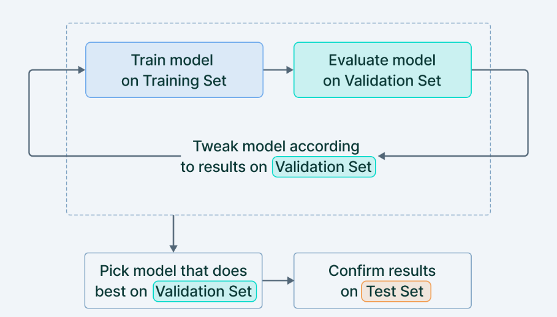
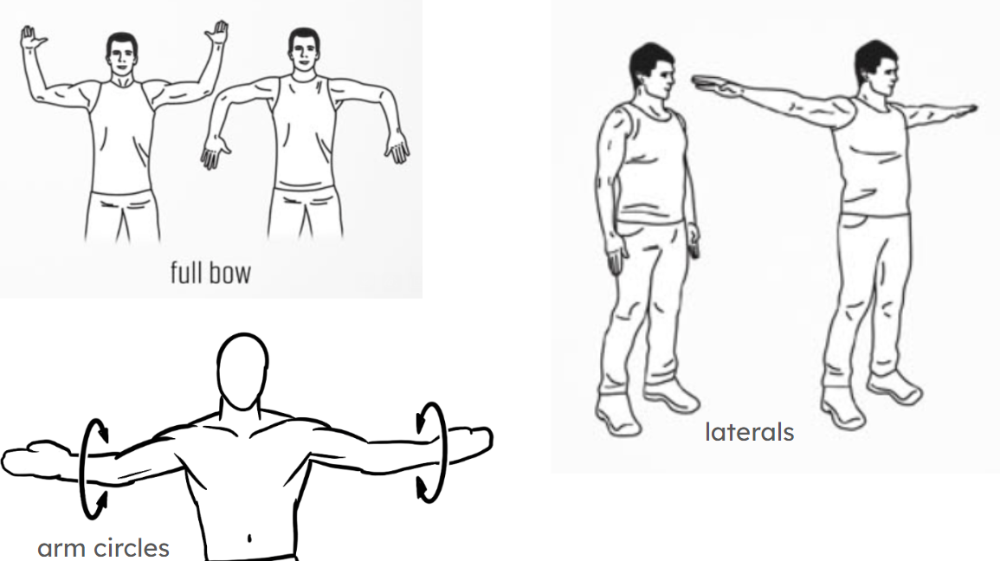
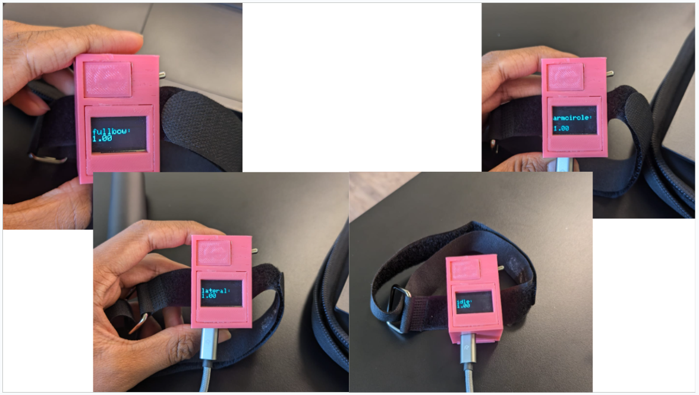

# Shoulder Recovery Project
This project aids in the recovery process of a rotator cuff injury. This shoulder device uses an Arduino Nano 33 Sense 33 BLE Sense board and alerts the user whenever they make a shoulder movement that is unadvised and puts them backward in their recovery process. The board is being trained using Edge Impulse, where I am recording thousands of data and Edge Impulse is compiling them creating a range of "good movements". 
<!-- Replace this text with a brief description (2-3 sentences) of your project. This description should draw the reader in and make them interested in what you've built. You can include what the biggest challenges, takeaways, and triumphs from completing the project were. As you complete your portfolio, remember your audience is less familiar than you are with all that your project entails! -->

| **Engineer** | **School** | **Area of Interest** | **Grade** |
|:--:|:--:|:--:|:--:|
| Vedant S | Monta Vista | Electrical Engineering | Incoming Sophomore

<!-- 
**Replace the BlueStamp logo below with an image of yourself and your completed project. Follow the guide [here](https://tomcam.github.io/least-github-pages/adding-images-github-pages-site.html) if you need help.**
-->


# Final Milestone

<iframe width="560" height="315" src="https://www.youtube.com/embed/JZwXgedtqrc?si=w9vaD7sz02Kj_QEa" title="YouTube video player" frameborder="0" allow="accelerometer; autoplay; clipboard-write; encrypted-media; gyroscope; picture-in-picture; web-share" referrerpolicy="strict-origin-when-cross-origin" allowfullscreen></iframe>


**Summary:**
My final milestone is to deploy my shoulder movement model onto the Arduino Nano 33 Sense BLE! I made it completely wireless and print out the ML predictions onto the OLED screen. I redid my model to focus on testing accuracy and shoulder movements that I found online. When I first made the model, I only checked the training accuracy, without looking at the testing accuracy (look below at Figure 11 for the differences). I eventually looked at the testing accuracy and realized that the model was memorizing the training data. I knew it was memorizing because it was performing well on training data, but on testing data (unseen data) it was not doing well. After this, I tried running my model in my terminal and realized that some of my movements and classes overlap, making it very hard for the model to distinguish the different shoulder movements into distinct classes. 


<!--

-->

**Figure 11: This is a screenshot of the differences between the train, test, and validation data sets. The validation data set is usually just segmented off the train data test. If the validation accuracy is not high (90+) then you can redo the top part until you get that desired accuracy. (See bottom of page for source)**



**Figure 10: This is a photo of all 3 exercises I used in my model. (See at the bottom of the page for the source)**


The best way to continue was to record new data and redesign the architecture for my model. I chose 4 new classes based on exercises: full bow, arm circle, lateral raise, and idle(regular movement) (see Figure 10 above). I collected more data roughly 10 minutes total after splitting all the data, and got a fully trained model with 100% training accuracy (see Figure 9) and 97% test accuracy. After this, for some reason, when I tried deploying my model onto my embedded device (Arduino Nano 33 BLE Sense) the predictions were random. This took a lot of time to troubleshoot and fix.


**Figure 9: This is a picture of my finished training model and the training accuracy.**

Once I could deploy my model, I coded the OLED so it shows the label and its prediction of how accurate it is. This display refreshes every 2 seconds. In my code, I first found out the highest prediction that the model outputs (ex: idle: 0.996) - then it stores that value into a variable. Once I find the highest value then I print out that value along with the label that the value is associated with (see Figure 8).  



**Figure 8: This is a photo of all 4 of my movement classes that are all displaying 100 percent accuracy.**


**Challenges:**
I have faced many challenges during this final milestone. The first major one is when I realized that my model was not doing well in the testing data. As explained above, I had to restart my model and decided to classify the data more distinctly. I separated the shoulder movements that had little to no overlap. I decided to do exercises because different exercises specifically target different parts of the shoulder so it would be the most efficient way to create the classes. When the classes and data overlap, your model can become inaccurate. 

The second major challenge that I faced was with deploying my code into Arduino. For some reason whenever I deployed my code from Edge Impulse onto the Arduino IDE, it would misclassify the data and it seemed like sometimes it would just guess. I tried to import many different versions of the code to see if one would work once I deployed it onto the Arduino. Eventually, my instructor and I figured out that my target device was not set to the Nano. Once I changed that, I deployed it onto the Arduino IDE and it worked!

**What's next?**
Now that I have finished my project I can start working on my modifications. Some ideas that I have so far are: 
- Connecting AI to my Arduino giving live suggestions on the spot and then printing them out onto the OLED
- Connecting the Arduino to my phone and making a small app where I can display data and suggestions to

<!--
**Don't forget to replace the text below with the embedding for your milestone video. Go to Youtube, click Share -> Embed, and copy and paste the code to replace what's below.**

<iframe width="560" height="315" src="https://www.youtube.com/embed/F7M7imOVGug" title="YouTube video player" frameborder="0" allow="accelerometer; autoplay; clipboard-write; encrypted-media; gyroscope; picture-in-picture; web-share" allowfullscreen></iframe>

For your final milestone, explain the outcome of your project. Key details to include are:
- What you've accomplished since your previous milestone
- What your biggest challenges and triumphs were at BSE
- A summary of key topics you learned about
- What you hope to learn in the future after everything you've learned at BSE

-->


# Second Milestone

<iframe width="560" height="315" src="https://www.youtube.com/embed/pXe6PBbaICc?si=IjKu5BtEdx9hOn4C" title="YouTube video player" frameborder="0" allow="accelerometer; autoplay; clipboard-write; encrypted-media; gyroscope; picture-in-picture; web-share" referrerpolicy="strict-origin-when-cross-origin" allowfullscreen></iframe>

**Summary:**
The second milestone for my project is to CAD a 3D-printed box on Fusion 360 (see Figure 7), build my circuit, and fit the circuit inside of the box. (cont.)

 


**Figure 7: On the left is a screenshot of my final CAD on Fusion 360. I have 4 separate bodies (the main body, the OLED cover, the switch cover, and the slider lid. On the right is a photo of my final box. I have uploaded some scroll code to make sure all the circuits are working.**         

My circuit (see Figure 6) includes 3 parts: Arduino Nano BLE Sense (microcontroller), OLED screen, and the on/off switch. The main circuit is between the Arduino and the OLED screen, the switch rests between the power cable that goes from the Arduino to the OLED screen. When the switch turns on it connects the power cables, but when it is off it disables the connection. The other parts of the circuit include ground, SCL, and SDA wires. 


**Figure 6: This is a photo of my circuit.**

These wires are part of the I^2C protocol (see Figure 5) which first starts with identifying which port the target device is connected to. Once it identifies this then it starts the clock which switches from high to low in intervals so that the data is transferred efficiently. The data is only transfered on the rising edge which is how the data is controlled. The SCL line that is used to synchronously clock data in and out of a device. The SDA line is used to transmit data. 


**Figure 5: This is a photo of the I2C protocol. It first starts with the SDA line switching from high to low voltage, then the SCL line switches from high to low. Then the address frame is a 7 or 10-bit sequence that is unique to each "slave" (target device) and identifies the slave when the master (Arduino) wants to talk. The next message lets the slave know whether or not the master is going to be sending data. Every message is followed by an ACK/NACK bit which is returned to the sender if the data was successfully received.**

**Challenges:** 
Some challenges that I have faced during this time have been trying to optimize space and function. The process of CADing could have been a lot quicker if I had disregarded space, however, I wanted this project to have some practical uses, and having a massive block on my shoulder would be uncomfortable. Because of this, I tried to minimize the space used by the parts to have the smallest block possible. 

At first, I was trying to find different switches that would take up less space however, after lots of time, I realized that the switch that I wanted to implement was running an AC current which was not compatible with my circuit which ran on a DC current. After building my circuit I started CADing and came up with a design. However, after printing it out I realized that I had not calculated for tolerance, which is making all the dimensions slightly larger to calculate for the error that the 3D printer makes. Since originally I had not calculated for tolerance none of my components fit into my box. When the box printed out I also realized that I could make my box even smaller by layering the components inside. 


**What is next?**
Now I will make some small refinements to my model, upload the model to the Arduino Nano BLE, and then start on my modifications. 


<!--
**Don't forget to replace the text below with the embedding for your milestone video. Go to Youtube, click Share -> Embed, and copy and paste the code to replace what's below.**

<iframe width="560" height="315" src="https://www.youtube.com/embed/y3VAmNlER5Y" title="YouTube video player" frameborder="0" allow="accelerometer; autoplay; clipboard-write; encrypted-media; gyroscope; picture-in-picture; web-share" allowfullscreen></iframe>

For your second milestone, explain what you've worked on since your previous milestone. You can highlight:
- Technical details of what you've accomplished and how they contribute to the final goal
- What has been surprising about the project so far
- Previous challenges you faced that you overcame
- What needs to be completed before your final milestone 

-->

# First Milestone

<iframe width="560" height="315" src="https://www.youtube.com/embed/kX5n4q9cTTE?si=_l9Z2tKIlmfRK0sR" title="YouTube video player" frameborder="0" allow="accelerometer; autoplay; clipboard-write; encrypted-media; gyroscope; picture-in-picture; web-share" referrerpolicy="strict-origin-when-cross-origin" allowfullscreen></iframe>


**Summary:**
The first milestone of my project is to deploy a machine-learning model onto an Arduino Nano BLE Sense 33 with Edge Impulse. I ran this with the terminal and it printed out how confident it was with predicting a certain movement that I had made (see below at Figure 4).


**Figure 4: This is an example screenshot of the predictions that my model made. You can see that it makes a prediction of x% on one of the 4 classes that I have made.**

The first step would be to connect a device. Then the machine workflow starts with data acquisition, then you have to preprocess the data, then design the neural network (see Figure 3 for my example), and finally, we can train our model. Currently, I uploaded the code that Edge Impulse made directly onto the Nano Sense 33, which requires a wired connection with the computer. Eventually, I want the code to be deployed wirelessly on the Nano itself.

Until now I have set up Edge Impulse on my computer using the CLI (command line interface), trained my model in Edge Impulse, and then uploaded the code onto the nano.

In Edge Impulse I trained 4 different sets of data: idle, right, left, and up. I strapped my Arduino Nano 33 BLE Sense to my arm and did these movements repeatedly with just slight adjustments each time. Slight adjustments led to various data so the model could become generalized. After I inputted the data, I kept customizing certain settings in each step of the workflow (more on this further down), eventually getting a pretty accurate model. So far, I have not made edits to the code, but I plan to make the code more customizable later on.

**Challenges:** 
The most frustrating thing of the entire process so far was the lack of instructions and steps that Arduino/Edge Impulse had to be able to set up the project. However, once I overcame the long process of setting up all the tools necessary, things became much easier, but I was not home-free yet. I became excited that I had finally set up everything I immediately jumped into recording data - without fully understanding what I was doing causing:

- Me to record data that was useless (twice!!!),
- Uploaded code that did not do anything,
- Mislabeling my data which caused massive accuracy issues,
- Finding the hyperparameters for my data (learning rate, # of epochs, percentage of validation set).

When I originally recorded my data I was doing random movements in each class - however, the computer requires very distinct specific movements to be able to learn the most accurately, because of this I went back and manually cleaned/re-record some data that was not distinct enough for the computer. Finding the best hyperparameters for the data was another task that took lots of time. First, I had to understand all the settings, after that, I was able to start playing with my data. The thing that made the biggest difference was the learning rate (see Figure 2). Originally the learning rate was too low and after I increased it the accuracy jumped up by 60 percent.

**What is next?**
The next steps are now to build the circuit and assemble the entire project, with the main step during that next process to CAD and then eventually printing out the 3D-printed case which will hold the entire circuit. Another big step would be to deploy my code onto the Arduino IDE while also increasing some accuracy. 

<!--
<details>
  <summary><b>Code for Milestone 1: Edge Impulse Model</b></summary>
</details>
-->


**Figure 3: This is a screenshot of the neural network that I created for my data set. I wanted a deep and wide neural network as I had lots of data and there needed to be lots of processing power. To create a wide network I increased the number of neurons in each layer to 48, and to create a deep network I added 3 separate layers of 48 neurons. I also added a drop rate after each layer of 0.2. This forces the machine to learn as if there is not a drop rate then the machine will just memorize the path of your training data giving you a false accuracy. This drops out a few neurons each layer making the machine learn different patterns.**


**Figure 2: A graph of what happens when the learning rate is too high/low. The yellow dot is where one starts if the learning rate is too high then the vector will jump around trying to find that optimal point. If the vectors are too small then it makes many small changes which will take too much time. (See Learning Rate link at the bottom of the page)**

<!--

**Don't forget to replace the text below with the embedding for your milestone video. Go to Youtube, click Share -> Embed, and copy and paste the code to replace what's below.**

<iframe width="560" height="315" src="https://www.youtube.com/embed/CaCazFBhYKs" title="YouTube video player" frameborder="0" allow="accelerometer; autoplay; clipboard-write; encrypted-media; gyroscope; picture-in-picture; web-share" allowfullscreen></iframe>

For your first milestone, describe what your project is and how you plan to build it. You can include:
- An explanation about the different components of your project and how they will all integrate together
- Technical progress you've made so far
- Challenges you're facing and solving in your future milestones
- What your plan is to complete your project

# Schematics 
Here's where you'll put images of your schematics. [Tinkercad](https://www.tinkercad.com/blog/official-guide-to-tinkercad-circuits) and [Fritzing](https://fritzing.org/learning/) are both great resoruces to create professional schematic diagrams, though BSE recommends Tinkercad becuase it can be done easily and for free in the browser. 

# Code
Here's where you'll put your code. The syntax below places it into a block of code. Follow the guide [here]([url](https://www.markdownguide.org/extended-syntax/)) to learn how to customize it to your project needs. 

```c++
void setup() {
  // put your setup code here, to run once:
  Serial.begin(9600);
  Serial.println("Hello World!");
}

void loop() {
  // put your main code here, to run repeatedly:

}
```
-->

# Bill of Materials

<a href="https://www.digikey.com/en/products/detail/adam-tech/SW-T3-1A-A-A3-S1/15284460?utm_adgroup=&utm_source=google&utm_medium=cpc&utm_campaign=PMax%20Shopping_Product_Low%20ROAS%20Categories&utm_term=&utm_content=&utm_id=go_cmp-20243063506_adg-_ad-__dev-c_ext-_prd-15284460_sig-Cj0KCQjwkdO0BhDxARIsANkNcrcpppuA1xDnv6HyRzlBbA-g4qBC06FePn6DcMNMxx-qPRmN4n68W8oaAkyCEALw_wcB&gad_source=1&gclid=Cj0KCQjwkdO0BhDxARIsANkNcrcpppuA1xDnv6HyRzlBbA-g4qBC06FePn6DcMNMxx-qPRmN4n68W8oaAkyCEALw_wcB">Arduino.</a>


- Arduino Nano 33 BLE Sense: 
<!--

Here's where you'll list the parts in your project. To add more rows, just copy and paste the example rows below.
Don't forget to place the link of where to buy each component inside the quotation marks in the corresponding row after href =. Follow the guide [here]([url](https://www.markdownguide.org/extended-syntax/)) to learn how to customize this to your project needs. 


| **Part** | **Note** | **Price** | **Link** |
|:--:|:--:|:--:|:--:|
| Arduino Nano33 BLE Sense | Microcomputer used to store code identifying different movements that user makes | $34.80 | <a href="https://store-usa.arduino.cc/products/nano-33-ble-sense-rev2-with-headers?gad_source=1&gclid=CjwKCAjwg8qzBhAoEiwAWagLrGZpO0uCQlcYXwoyQo1uV1hVKdxjny7cgm1z-Cc4NqsN9SuL9b_EGxoCO8AQAvD_BwE"> Link </a> |
| OLED Screen | To display user's progress with arm movements | $5.00 | <a href="https://geekworm.com/products/0-96-inch-oled?variant=39982251671640&currency=USD&utm_medium=product_sync&utm_source=google&utm_content=sag_organic&utm_campaign=sag_organic&srsltid=AfmBOoo_Xjfk_CSJ04SWm9pKG7w3IMF9L5JKRlc9OFoA2WHD6CZBDicif4k&com_cvv=8fb3d522dc163aeadb66e08cd7450cbbdddc64c6cf2e8891f6d48747c6d56d2c"> Link </a> |
| Toggle Switch | Used as a on/off switch | $1.00 | <a href="https://www.digikey.com/en/products/detail/adam-tech/SW-T3-1A-A-A3-S1/15284460?utm_adgroup=&utm_source=google&utm_medium=cpc&utm_campaign=PMax%20Shopping_Product_Low%20ROAS%20Categories&utm_term=&utm_content=&utm_id=go_cmp-20243063506_adg-_ad-__dev-c_ext-_prd-15284460_sig-Cj0KCQjwkdO0BhDxARIsANkNcrcpppuA1xDnv6HyRzlBbA-g4qBC06FePn6DcMNMxx-qPRmN4n68W8oaAkyCEALw_wcB&gad_source=1&gclid=Cj0KCQjwkdO0BhDxARIsANkNcrcpppuA1xDnv6HyRzlBbA-g4qBC06FePn6DcMNMxx-qPRmN4n68W8oaAkyCEALw_wcB"> Link </a> |

-->

# Starter Project

<iframe width="560" height="315" src="https://www.youtube.com/embed/qdelkj9V17M?si=obpftZMP8jghWpjv" title="YouTube video player" frameborder="0" allow="accelerometer; autoplay; clipboard-write; encrypted-media; gyroscope; picture-in-picture; web-share" referrerpolicy="strict-origin-when-cross-origin" allowfullscreen></iframe>

**Summary:**
I built a small circuit on the Arduino Uno for my starter project. The circuit gets input from the motion sensor (refer to Figure 1) which either gives us a 'high' or 'low' data value. If the motion sensor does not detect motion then a red LED is lit up and if it does detect motion then a green LED is lit up along with a pienzo buzzer making a buzzing sound providing an audio distinction. I coded this with a simple if-else checking that if the motion sensor returns 'high' then we light up the green LED + piezo buzzer, else we turn on the red LED. I also added a potentiometer to control the pitch of the piezo buzzer's sound. We have to put the potentiometer on the analog side because we incrementally change the pitch. Some challenges that I faced when doing this starter project were mainly my lack of knowledge of the tools and the components. After I learned the basics of Arduino, how to wire, how different sensors work, and the main wiring conventions, I was able to build circuits much faster.


**Figure 1: A basic motion sensor with 3 ports where power(VCC), ground(GND), and a digital port(OUT) are connected. (See Motion Sensor link at the bottom of the page)**


# Works Cited

- [Learning Rate](https://www.jeremyjordan.me/nn-learning-rate/)
- [Motion Sensor](https://lastminuteengineers.com/pir-sensor-arduino-tutorial/)
- [I2C Protocol](https://www.circuitbasics.com/basics-of-the-i2c-communication-protocol/)
- [Laterals](https://darebee.com/workouts/shoulder-arms-workout)
- [ArmCircles](https://exer-pedia.com/exercise/shoulder-arm-mobility-circles/)
- [TrainTest](https://www.v7labs.com/blog/train-validation-test-set)
- [FullBow](https://darebee.com/workouts/rotator-cuff-workout.html)
  
<!--

One of the best parts about Github is that you can view how other people set up their own work. Here are some past BSE portfolios that are awesome examples. You can view how they set up their portfolio, and you can view their index.md files to understand how they implemented different portfolio components.
- [Example 1](https://trashytuber.github.io/YimingJiaBlueStamp/)
- [Example 2](https://sviatil0.github.io/Sviatoslav_BSE/)
- [Example 3](https://arneshkumar.github.io/arneshbluestamp/)

To watch the BSE tutorial on how to create a portfolio, click here.

-->
# Final Code
```c++

/* Edge Impulse ingestion SDK
 * Copyright (c) 2023 EdgeImpulse Inc.
 *
 * Licensed under the Apache License, Version 2.0 (the "License");
 * you may not use this file except in compliance with the License.
 * You may obtain a copy of the License at
 * http://www.apache.org/licenses/LICENSE-2.0
 *
 * Unless required by applicable law or agreed to in writing, software
 * distributed under the License is distributed on an "AS IS" BASIS,
 * WITHOUT WARRANTIES OR CONDITIONS OF ANY KIND, either express or implied.
 * See the License for the specific language governing permissions and
 * limitations under the License.
 *
 */

/* Includes ---------------------------------------------------------------- */
#include <BSE_Shoulder_Project_acc___gyro__v3_inferencing.h>
#include <Arduino_BMI270_BMM150.h> //Click here to get the library: https://www.arduino.cc/reference/en/libraries/arduino_bmi270_bmm150/
#include <Arduino_LPS22HB.h> //Click here to get the library: https://www.arduino.cc/reference/en/libraries/arduino_lps22hb/
#include <Arduino_HS300x.h> //Click here to get the library: https://www.arduino.cc/reference/en/libraries/arduino_hs300x/
#include <Arduino_APDS9960.h> //Click here to get the library: https://www.arduino.cc/reference/en/libraries/arduino_apds9960/

#include <Wire.h>
#include <Adafruit_GFX.h>
#include <Adafruit_SSD1306.h>

Adafruit_SSD1306 display(128 , 64, &Wire, -1);


enum sensor_status {
    NOT_USED = -1,
    NOT_INIT,
    INIT,
    SAMPLED
};

/** Struct to link sensor axis name to sensor value function */
typedef struct{
    const char *name;
    float *value;
    uint8_t (*poll_sensor)(void);
    bool (*init_sensor)(void);    
    sensor_status status;
} eiSensors;

/* Constant defines -------------------------------------------------------- */
#define CONVERT_G_TO_MS2    9.80665f
#define MAX_ACCEPTED_RANGE  2.0f        // starting 03/2022, models are generated setting range to +-2,
                                        // but this example use Arudino library which set range to +-4g. 
                                        // If you are using an older model, ignore this value and use 4.0f instead
/** Number sensor axes used */
#define N_SENSORS     18

/* Forward declarations ------------------------------------------------------- */
float ei_get_sign(float number);

bool init_IMU(void);
bool init_HTS(void);
bool init_BARO(void);
bool init_APDS(void);

uint8_t poll_acc(void);
uint8_t poll_gyr(void);
uint8_t poll_mag(void);
uint8_t poll_HTS(void);
uint8_t poll_BARO(void);
uint8_t poll_APDS_color(void);
uint8_t poll_APDS_proximity(void);
uint8_t poll_APDS_gesture(void);

/* Private variables ------------------------------------------------------- */
static const bool debug_nn = false; // Set this to true to see e.g. features generated from the raw signal

static float data[N_SENSORS];
static bool ei_connect_fusion_list(const char *input_list);

static int8_t fusion_sensors[N_SENSORS];
static int fusion_ix = 0;

/** Used sensors value function connected to label name */
eiSensors sensors[] =
{
    "accX", &data[0], &poll_acc, &init_IMU, NOT_USED,
    "accY", &data[1], &poll_acc, &init_IMU, NOT_USED,
    "accZ", &data[2], &poll_acc, &init_IMU, NOT_USED,
    "gyrX", &data[3], &poll_gyr, &init_IMU, NOT_USED,
    "gyrY", &data[4], &poll_gyr, &init_IMU, NOT_USED,
    "gyrZ", &data[5], &poll_gyr, &init_IMU, NOT_USED,
    "magX", &data[6], &poll_mag, &init_IMU, NOT_USED,
    "magY", &data[7], &poll_mag, &init_IMU, NOT_USED,
    "magZ", &data[8], &poll_mag, &init_IMU, NOT_USED,

    "temperature", &data[9], &poll_HTS, &init_HTS, NOT_USED,
    "humidity", &data[10], &poll_HTS, &init_HTS, NOT_USED,

    "pressure", &data[11], &poll_BARO, &init_BARO, NOT_USED,

    "red", &data[12], &poll_APDS_color, &init_APDS, NOT_USED,
    "green", &data[13], &poll_APDS_color, &init_APDS, NOT_USED,
    "blue", &data[14], &poll_APDS_color, &init_APDS, NOT_USED,
    "brightness", &data[15], &poll_APDS_color, &init_APDS, NOT_USED,
    "proximity", &data[16], &poll_APDS_proximity, &init_APDS, NOT_USED,
    "gesture", &data[17], &poll_APDS_gesture,&init_APDS, NOT_USED,
};

/**
* @brief      Arduino setup function
*/
void setup()
{
    /* Init serial */
    Serial.begin(115200);
    // comment out the below line to cancel the wait for USB connection (needed for native USB)


    //OLED CODE STARTS HERE
    if(!display.begin(SSD1306_SWITCHCAPVCC, 0x3C)) { // Address 0x3D for 128x64
      Serial.println(F("SSD1306 allocation failed"));
      for(;;);
    }
    delay(2000);
    display.clearDisplay();

    display.setTextSize(1);
    display.setTextColor(WHITE);
    display.setCursor(0, 3);
    // Display static text
    display.println("Hello, world!");
    //OLED CODE FINISHES HERE


    Serial.println("Edge Impulse Sensor Fusion Inference\r\n");

    /* Connect used sensors */
    if(ei_connect_fusion_list(EI_CLASSIFIER_FUSION_AXES_STRING) == false) {
        ei_printf("ERR: Errors in sensor list detected\r\n");
        return;
    }

    /* Init & start sensors */

    for(int i = 0; i < fusion_ix; i++) {
        if (sensors[fusion_sensors[i]].status == NOT_INIT) {
            sensors[fusion_sensors[i]].status = (sensor_status)sensors[fusion_sensors[i]].init_sensor();
            if (!sensors[fusion_sensors[i]].status) {
              ei_printf("%s axis sensor initialization failed.\r\n", sensors[fusion_sensors[i]].name);             
            }
            else {
              ei_printf("%s axis sensor initialization successful.\r\n", sensors[fusion_sensors[i]].name);
            }
        }
    }
}

/**
* @brief      Get data and run inferencing
*/
void loop()
{
    float max = 0;
    String name = "";

    ei_printf("\nStarting inferencing in 2 seconds...\r\n");

    delay(2000);

    if (EI_CLASSIFIER_RAW_SAMPLES_PER_FRAME != fusion_ix) {
        ei_printf("ERR: Sensors don't match the sensors required in the model\r\n"
        "Following sensors are required: %s\r\n", EI_CLASSIFIER_FUSION_AXES_STRING);
        return;
    }

    ei_printf("Sampling...\r\n");

    // Allocate a buffer here for the values we'll read from the sensor
    float buffer[EI_CLASSIFIER_DSP_INPUT_FRAME_SIZE] = { 0 };

    for (size_t ix = 0; ix < EI_CLASSIFIER_DSP_INPUT_FRAME_SIZE; ix += EI_CLASSIFIER_RAW_SAMPLES_PER_FRAME) {
        // Determine the next tick (and then sleep later)
        int64_t next_tick = (int64_t)micros() + ((int64_t)EI_CLASSIFIER_INTERVAL_MS * 1000);

        for(int i = 0; i < fusion_ix; i++) {
            if (sensors[fusion_sensors[i]].status == INIT) {
                sensors[fusion_sensors[i]].poll_sensor();
                sensors[fusion_sensors[i]].status = SAMPLED;
            }
            if (sensors[fusion_sensors[i]].status == SAMPLED) {
                buffer[ix + i] = *sensors[fusion_sensors[i]].value;
                sensors[fusion_sensors[i]].status = INIT;
            }
        }

        int64_t wait_time = next_tick - (int64_t)micros();

        if(wait_time > 0) {
            delayMicroseconds(wait_time);
        }
    }

    // Turn the raw buffer in a signal which we can the classify
    signal_t signal;
    int err = numpy::signal_from_buffer(buffer, EI_CLASSIFIER_DSP_INPUT_FRAME_SIZE, &signal);
    if (err != 0) {
        ei_printf("ERR:(%d)\r\n", err);
        return;
    }

    // Run the classifier
    ei_impulse_result_t result = { 0 };

    err = run_classifier(&signal, &result, debug_nn);
    if (err != EI_IMPULSE_OK) {
        ei_printf("ERR:(%d)\r\n", err);
        return;
    }

    // print the predictions
    ei_printf("Predictions (DSP: %d ms., Classification: %d ms., Anomaly: %d ms.):\r\n",
        result.timing.dsp, result.timing.classification, result.timing.anomaly);
    max = result.classification[0].value;
    for (size_t ix = 0; ix < EI_CLASSIFIER_LABEL_COUNT; ix++) {
        ei_printf("%s: %.5f\r\n", result.classification[ix].label, result.classification[ix].value);
        
        if (max <= result.classification[ix].value)
        {
          //name = result.classification[ix].label;
          max = result.classification[ix].value;
          //ei_printf("%.5s:", name);
          display.clearDisplay();
          ei_printf("%.5f\r\n",max);
          display.setTextSize(2.5);
          display.setTextColor(WHITE);
          display.setCursor(0, 16);
          display.print(String(result.classification[ix].label) + ": \n");
          display.print(String(max));
          display.display();

        }
        /*
        if (ix = 3)
        {
          display.setTextSize(1);
          display.setTextColor(WHITE);
          display.setCursor(0, 20);
          display.print(String(result.classification[ix].label) + ": " + String(result.classification[ix].value));
          //display.printf("%s: %.5f\r\n", result.classification[ix].label, result.classification[ix].value);
          display.display();
        }
        */
    }
#if EI_CLASSIFIER_HAS_ANOMALY == 1
    ei_printf("    anomaly score: %.3f\r\n", result.anomaly);
#endif
}

#if !defined(EI_CLASSIFIER_SENSOR) || (EI_CLASSIFIER_SENSOR != EI_CLASSIFIER_SENSOR_FUSION && EI_CLASSIFIER_SENSOR != EI_CLASSIFIER_SENSOR_ACCELEROMETER)
#error "Invalid model for current sensor"
#endif


/**
 * @brief Go through sensor list to find matching axis name
 *
 * @param axis_name
 * @return int8_t index in sensor list, -1 if axis name is not found
 */
static int8_t ei_find_axis(char *axis_name)
{
    int ix;
    for(ix = 0; ix < N_SENSORS; ix++) {
        if(strstr(axis_name, sensors[ix].name)) {
            return ix;
        }
    }
    return -1;
}

/**
 * @brief Check if requested input list is valid sensor fusion, create sensor buffer
 *
 * @param[in]  input_list      Axes list to sample (ie. "accX + gyrY + magZ")
 * @retval  false if invalid sensor_list
 */
static bool ei_connect_fusion_list(const char *input_list)
{
    char *buff;
    bool is_fusion = false;

    /* Copy const string in heap mem */
    char *input_string = (char *)ei_malloc(strlen(input_list) + 1);
    if (input_string == NULL) {
        return false;
    }
    memset(input_string, 0, strlen(input_list) + 1);
    strncpy(input_string, input_list, strlen(input_list));

    /* Clear fusion sensor list */
    memset(fusion_sensors, 0, N_SENSORS);
    fusion_ix = 0;

    buff = strtok(input_string, "+");

    while (buff != NULL) { /* Run through buffer */
        int8_t found_axis = 0;

        is_fusion = false;
        found_axis = ei_find_axis(buff);

        if(found_axis >= 0) {
            if(fusion_ix < N_SENSORS) {
                fusion_sensors[fusion_ix++] = found_axis;
                sensors[found_axis].status = NOT_INIT;
            }
            is_fusion = true;
        }

        buff = strtok(NULL, "+ ");
    }

    ei_free(input_string);

    return is_fusion;
}

/**
 * @brief Return the sign of the number
 * 
 * @param number 
 * @return int 1 if positive (or 0) -1 if negative
 */
float ei_get_sign(float number) {
    return (number >= 0.0) ? 1.0 : -1.0;
}

bool init_IMU(void) {
  static bool init_status = false;
  if (!init_status) {
    init_status = IMU.begin();
  }
  return init_status;
}

bool init_HTS(void) {
  static bool init_status = false;
  if (!init_status) {
    init_status = HS300x.begin();
  }
  return init_status;
}

bool init_BARO(void) {
  static bool init_status = false;
  if (!init_status) {
    init_status = BARO.begin();
  }
  return init_status;
}

bool init_APDS(void) {
  static bool init_status = false;
  if (!init_status) {
    init_status = APDS.begin();
  }
  return init_status;
}

uint8_t poll_acc(void) {
  
    if (IMU.accelerationAvailable()) {

    IMU.readAcceleration(data[0], data[1], data[2]);

    for (int i = 0; i < 3; i++) {
        if (fabs(data[i]) > MAX_ACCEPTED_RANGE) {
            data[i] = ei_get_sign(data[i]) * MAX_ACCEPTED_RANGE;
        }
    }

    data[0] *= CONVERT_G_TO_MS2;
    data[1] *= CONVERT_G_TO_MS2;
    data[2] *= CONVERT_G_TO_MS2;
    }

    return 0;
}

uint8_t poll_gyr(void) {
  
    if (IMU.gyroscopeAvailable()) {
        IMU.readGyroscope(data[3], data[4], data[5]);
    }
    return 0;
}

uint8_t poll_mag(void) {
  
    if (IMU.magneticFieldAvailable()) {
        IMU.readMagneticField(data[6], data[7], data[8]);
    }
    return 0;
}

uint8_t poll_HTS(void) {
  
    data[9] = HS300x.readTemperature();
    data[10] = HS300x.readHumidity();
    return 0;
}

uint8_t poll_BARO(void) {
  
    data[11] = BARO.readPressure(); // (PSI/MILLIBAR/KILOPASCAL) default kPa
    return 0;
}

uint8_t poll_APDS_color(void) {
  
    int temp_data[4];
    if (APDS.colorAvailable()) {
        APDS.readColor(temp_data[0], temp_data[1], temp_data[2], temp_data[3]);

        data[12] = temp_data[0];
        data[13] = temp_data[1];
        data[14] = temp_data[2];
        data[15] = temp_data[3];
    }
}

uint8_t poll_APDS_proximity(void) {

    if (APDS.proximityAvailable()) {
        data[16] = (float)APDS.readProximity();
    }
    return 0;
}

uint8_t poll_APDS_gesture(void) {
    if (APDS.gestureAvailable()) {
        data[17] = (float)APDS.readGesture();
    }
    return 0;
}

```
