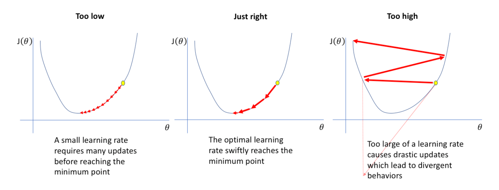
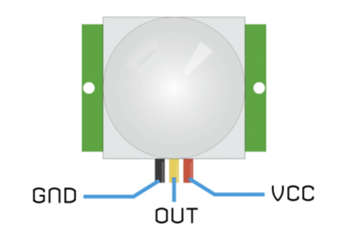

# Shoulder Recovery Project
This project aids in the recovery process of a rotator cuff injury. This shoulder device uses an Arduino Nano 33 Sense 33 BLE Sense board and alerts the user whenever they make a shoulder movement that is unadvised and puts them backward in their recovery process. The board is being trained using Edge Impulse, where I am recording thousands of data and Edge Impulse is compiling them creating a range of "good movements". 
<!-- Replace this text with a brief description (2-3 sentences) of your project. This description should draw the reader in and make them interested in what you've built. You can include what the biggest challenges, takeaways, and triumphs from completing the project were. As you complete your portfolio, remember your audience is less familiar than you are with all that your project entails! -->

| **Engineer** | **School** | **Area of Interest** | **Grade** |
|:--:|:--:|:--:|:--:|
| Vedant S | Monta Vista | Electrical Engineering | Incoming Softmore

<!-- 
**Replace the BlueStamp logo below with an image of yourself and your completed project. Follow the guide [here](https://tomcam.github.io/least-github-pages/adding-images-github-pages-site.html) if you need help.**
-->


# Final Milestone

<!--
**Don't forget to replace the text below with the embedding for your milestone video. Go to Youtube, click Share -> Embed, and copy and paste the code to replace what's below.**

<iframe width="560" height="315" src="https://www.youtube.com/embed/F7M7imOVGug" title="YouTube video player" frameborder="0" allow="accelerometer; autoplay; clipboard-write; encrypted-media; gyroscope; picture-in-picture; web-share" allowfullscreen></iframe>

For your final milestone, explain the outcome of your project. Key details to include are:
- What you've accomplished since your previous milestone
- What your biggest challenges and triumphs were at BSE
- A summary of key topics you learned about
- What you hope to learn in the future after everything you've learned at BSE

-->

# Second Milestone

<!--
**Don't forget to replace the text below with the embedding for your milestone video. Go to Youtube, click Share -> Embed, and copy and paste the code to replace what's below.**

<iframe width="560" height="315" src="https://www.youtube.com/embed/y3VAmNlER5Y" title="YouTube video player" frameborder="0" allow="accelerometer; autoplay; clipboard-write; encrypted-media; gyroscope; picture-in-picture; web-share" allowfullscreen></iframe>

For your second milestone, explain what you've worked on since your previous milestone. You can highlight:
- Technical details of what you've accomplished and how they contribute to the final goal
- What has been surprising about the project so far
- Previous challenges you faced that you overcame
- What needs to be completed before your final milestone 

-->

# First Milestone

**Summary:**
The end goal of my project is to have a functioning shoulder device that will tell you when you are doing movements that will not worsen your condition of Rotator Cuff Injury. Until now I have set up Edge Impulse, trained my model in Edge Impulse, and then uploaded the code into the Arduino IDE. In Edge Impulse I trained 4 different sets of data: idle, right, left, and up - I did this by simply strapping my Arduino Nano 33 BLE Sense to my arm and doing these movements over and over again with just slight adjustments each time. After I inputted the data, Edge Impulse trained it and gave me a sample code. So far, I have not made edits to the code, but I plan to make the code more customizable later on.

**Challenges:** 
The most frustrating thing of the entire process so far was the lack of instructions and steps that Arduino/Edge Impulse had to be able to set up the project. However, once I overcame the long process of setting up all the tools necessary, things became much easier, but I was not home-free yet. I became excited that I had finally set up everything I immediately jumped into recording data - without fully understanding what I was doing causing: 
1) Caused me to record data that was useless (twice!!!),\n
2) Uploaded code that did not do anything\n
3) Mislabing my data which caused massive accuracy issues,\n
4) Finding the best settings for my data (learning rate, # of epochs, percentage of validation set).\n
    
When I originally recorded my data I was doing random movements in each class - however, the computer requires very distinct specific movements to be able to learn the most accurately, because of this I went back and manually cleaned/re-record some data that was not distinct enough for the computer. Finding the best settings for the data was another task that took lots of time. First, I had to understand all the settings, after that, I was able to start playing with my data. The thing that made the biggest difference was the learning diagram (see Figure 2). 

**What is next?**
The next steps are now to build the circuit and assemble the entire project, with the main step during that next process to CAD and then eventually print out the 3D-printed case which will hold the entire circuit. 

**Figure 2: A graph of what happens when the learning rate is too high/low.**



<!--

**Don't forget to replace the text below with the embedding for your milestone video. Go to Youtube, click Share -> Embed, and copy and paste the code to replace what's below.**

<iframe width="560" height="315" src="https://www.youtube.com/embed/CaCazFBhYKs" title="YouTube video player" frameborder="0" allow="accelerometer; autoplay; clipboard-write; encrypted-media; gyroscope; picture-in-picture; web-share" allowfullscreen></iframe>

For your first milestone, describe what your project is and how you plan to build it. You can include:
- An explanation about the different components of your project and how they will all integrate together
- Technical progress you've made so far
- Challenges you're facing and solving in your future milestones
- What your plan is to complete your project

# Schematics 
Here's where you'll put images of your schematics. [Tinkercad](https://www.tinkercad.com/blog/official-guide-to-tinkercad-circuits) and [Fritzing](https://fritzing.org/learning/) are both great resoruces to create professional schematic diagrams, though BSE recommends Tinkercad becuase it can be done easily and for free in the browser. 

# Code
Here's where you'll put your code. The syntax below places it into a block of code. Follow the guide [here]([url](https://www.markdownguide.org/extended-syntax/)) to learn how to customize it to your project needs. 

```c++
void setup() {
  // put your setup code here, to run once:
  Serial.begin(9600);
  Serial.println("Hello World!");
}

void loop() {
  // put your main code here, to run repeatedly:

}
```
-->

# Bill of Materials

<!--

Here's where you'll list the parts in your project. To add more rows, just copy and paste the example rows below.
Don't forget to place the link of where to buy each component inside the quotation marks in the corresponding row after href =. Follow the guide [here]([url](https://www.markdownguide.org/extended-syntax/)) to learn how to customize this to your project needs. 

-->
| **Part** | **Note** | **Price** | **Link** |
|:--:|:--:|:--:|:--:|
| Arduino Nano33 BLE Sense | Microcomputer used to store code identifying different movements that user makes | $34.80 | <a href="https://store-usa.arduino.cc/products/nano-33-ble-sense-rev2-with-headers?gad_source=1&gclid=CjwKCAjwg8qzBhAoEiwAWagLrGZpO0uCQlcYXwoyQo1uV1hVKdxjny7cgm1z-Cc4NqsN9SuL9b_EGxoCO8AQAvD_BwE"> Link </a> |
| OLED Screen | To display user's progress with arm movements | $5.00 | <a href="https://geekworm.com/products/0-96-inch-oled?variant=39982251671640&currency=USD&utm_medium=product_sync&utm_source=google&utm_content=sag_organic&utm_campaign=sag_organic&srsltid=AfmBOoo_Xjfk_CSJ04SWm9pKG7w3IMF9L5JKRlc9OFoA2WHD6CZBDicif4k&com_cvv=8fb3d522dc163aeadb66e08cd7450cbbdddc64c6cf2e8891f6d48747c6d56d2c"> Link </a> |
| Item Name | What the item is used for | $Price | <a href="https://www.amazon.com/Arduino-A000066-ARDUINO-UNO-R3/dp/B008GRTSV6/"> Link </a> |


# Starter Project

<iframe width="560" height="315" src="https://www.youtube.com/embed/qdelkj9V17M?si=lpD4TQSAaymOdUEd" title="YouTube video player" frameborder="0" allow="accelerometer; autoplay; clipboard-write; encrypted-media; gyroscope; picture-in-picture; web-share" referrerpolicy="strict-origin-when-cross-origin" allowfullscreen></iframe>

**Summary:**
I built a small circuit on the Arduino Uno for my starter project. The circuit gets input from the motion sensor (refer to Figure 1) which either gives us a 'high' or 'low' data value. If the motion sensor does not detect motion then a red LED is lit up and if it does detect motion then a green LED is lit up along with a pienzo buzzer making a buzzing sound providing an audio distinction. I coded this with a simple if-else checking that if the motion sensor returns 'high' then we light up the green LED + piezo buzzer, else we turn on the red LED. I also added a potentiometer to control the pitch of the piezo buzzer's sound. We have to put the potentiometer on the analog side because we incrementally change the pitch. Some challenges that I faced when doing this starter project were mainly my lack of knowledge of the tools and the components. After I learned the basics of Arduino, how to wire, how different sensors work, and the main wiring conventions, I was able to build circuits much faster.

**Figure 1: A basic motion sensor with 3 ports where power(VCC), ground(GND), and a digital port(OUT) are connected**




# Other Resources/Examples

<!--

One of the best parts about Github is that you can view how other people set up their own work. Here are some past BSE portfolios that are awesome examples. You can view how they set up their portfolio, and you can view their index.md files to understand how they implemented different portfolio components.
- [Example 1](https://trashytuber.github.io/YimingJiaBlueStamp/)
- [Example 2](https://sviatil0.github.io/Sviatoslav_BSE/)
- [Example 3](https://arneshkumar.github.io/arneshbluestamp/)

To watch the BSE tutorial on how to create a portfolio, click here.

-->
